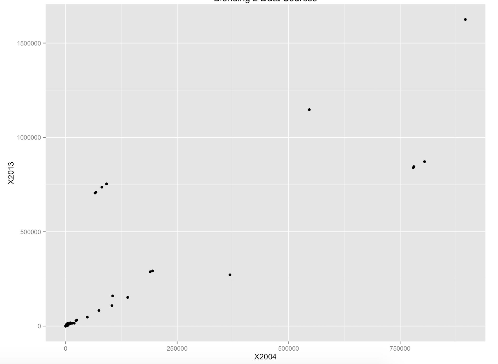

***
#How to Reproduce Our Work:
Step 1: Create GitHub Repo with necessary folders for partners to collaborate
      00 Doc contains the .Rmd and HTML files
      01 Data contains the data set that was worked with
      02 Shiny contains the server and user interface (ui) for the Shiny App
Step 2: Use an interesting data set with data that may be easily and interestingly manipulated
Step 3: Import the csv file into SQL Developer
Step 4: Save your app's server.R and ui.R script inside the 02 Shiny folder
Step 5: Launch the shinyApp with runApp and exit by clicking escape

***

#Data Summary:
Below is the dataset and first ten rows
```{r}
require("jsonlite")
require("RCurl")
require(ggplot2)
require(dplyr)

Indicators<- data.frame(fromJSON(getURL(URLencode('skipper.cs.utexas.edu:5001/rest/native/?query="select * from countries"'),httpheader=c(DB='jdbc:oracle:thin:@sayonara.microlab.cs.utexas.edu:1521:orcl', USER='C##cs329e_gmg954', PASS='orcl_gmg954', MODE='native_mode', MODEL='model', returnDimensions = 'False', returnFor = 'JSON'), verbose = TRUE)), ignoreNULL = FALSE)

head(Indicators)
``` 
###Data Explanation and Overal Manipulation:
The above dataset - called Indicators - is a time series collection from 1960 to 2015 of development indicators amongst varoous countires.  It presents the most current and accurate global development data available, and includes national, regional and global estimates. Our group used this pertinent data to evaluate various indicators of economic success: Number of trademark and patent applications, high technology exports, research and development expenditure charges for the use of intellectual property.

***

#Shiny Methodology
* Shiny is an R package that makes it easy to build interactive web applications (apps) straight from R.
* Shiny ui.R scripts use the function fluidPage to create a display that automatically adjusts to the dimensions of your user’s browser window. You lay out your app by placing elements in the fluidPage function.The user-interface (ui) script controls the layout and appearance of your app. It is defined in a source script named ui.R. Additionally, the server.R script contains the instructions that your computer needs to build your app.
* Most of the script is wrapped in a call to renderPlot. This is an expression that generates a histogram. renderPlot indicates that the expression is "reactive" and should automatically re-execute whenver input changes. It also specifies that the output type is a plot.

### Shiny App Walkthrough:
* link to our app:
* Dashboard App:
  + Bar Chart
  + Cross Tab + KPI
  + Scatter Plot

##Cross Tab with KPI
Importance: This cross tab shows highlights five countries trademark applicant statistics in the year 2005.  Countries include Mexico, Republic, Czech Republic, Brazil, and Belgium.  The three parameters we focused on were resident trademark applicants, non resident trademark applicants, and total trademark applicants within the country.  The KPI shows the difference between 2005 statistics and 2004 statistics.  A high kpi shows a growth of trademark applications where as a low kpi (below zero) shows a decline in trademark applicants from the year 2004 to 2005.


##Scatter Plot
Importance: This bar chart focusing on the country Japan, looking at specific parameters including trademark applicants (resident and non resident) as well as patent applicants in the year 2013.  This bar chart sums the amount in each of these categories so we can see that Japan has a higher number of patent applicants than trademark applicants for residents.  But for nonresidents, there are less patent applicants than there are both trademark applicants for residents.  We see that there are very few trademark applicants for non residents of Japan, but a high number of resident patent applications. 



##Bar Chart with Reference Line
Importance: This scatter plot shows the trend of patent applications from the year 2004 to 2013.  We see that the trend has been a linearly decreasing in patent applicants over the years.  There are a few exceptions with some countries where there has been a strong decrease in the number of patent applicants as we see in the outliers.  There are some countries, however, where patent applications have significantly increased from 2004.  We can see an example in the graph where in 2004, some points have approximately 75,000 patent applicants in 2004 and around 750,000 applicants in 2013.  The overall trend is a linear decrease in patent applicants with a few outliers, likely in developing nations.


***

